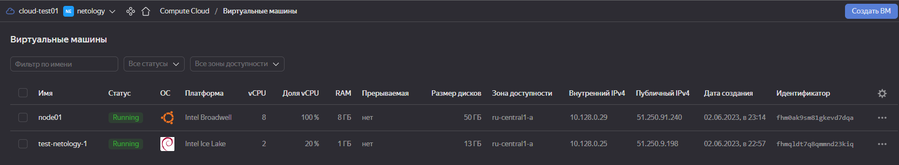
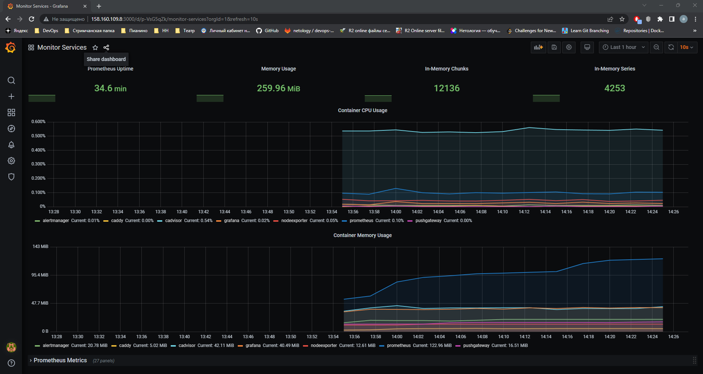
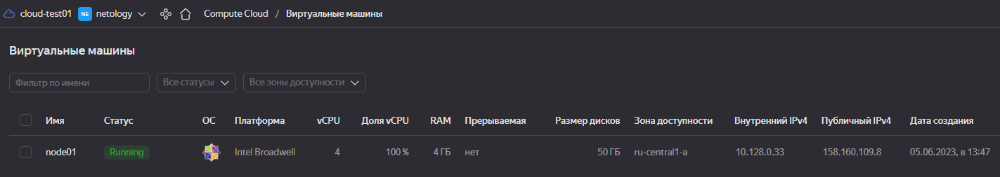

# Домашнее задание к занятию 3. «Введение. Экосистема. Архитектура. Жизненный цикл Docker-контейнера» Повечеровский А.В


## Задача 1

Создайте собственный образ любой операционной системы (например ubuntu-20.04) с помощью Packer ([инструкция](https://cloud.yandex.ru/docs/tutorials/infrastructure-management/packer-quickstart)).

Чтобы получить зачёт, вам нужно предоставить скриншот страницы с созданным образом из личного кабинета YandexCloud.


## Решение 1

### [Debian 11 with nginx build json](./res/debian11-nginx.json)

### [Clear ubuntu 20.04 build json](./res/ubuntu-2004.json)


## Задача 2

**2.1.** Создайте вашу первую виртуальную машину в YandexCloud с помощью web-интерфейса YandexCloud.        

**2.2.*** **(Необязательное задание)**      
Создайте вашу первую виртуальную машину в YandexCloud с помощью Terraform (вместо использования веб-интерфейса YandexCloud).
Используйте Terraform-код в директории ([src/terraform](https://github.com/netology-group/virt-homeworks/tree/virt-11/05-virt-04-docker-compose/src/terraform)).

Чтобы получить зачёт, вам нужно предоставить вывод команды terraform apply и страницы свойств, созданной ВМ из личного кабинета YandexCloud.


## Решение 2

### 2.1 


### 2.2

### [Вывод команды terraform apply](./res/terraform%20apply)


    

## Задача 3

С помощью Ansible и Docker Compose разверните на виртуальной машине из предыдущего задания систему мониторинга на основе Prometheus/Grafana.
Используйте Ansible-код в директории ([src/ansible](https://github.com/netology-group/virt-homeworks/tree/virt-11/05-virt-04-docker-compose/src/ansible)).

Чтобы получить зачёт, вам нужно предоставить вывод команды "docker ps" , все контейнеры, описанные в [docker-compose](https://github.com/netology-group/virt-homeworks/blob/virt-11/05-virt-04-docker-compose/src/ansible/stack/docker-compose.yaml),  должны быть в статусе "Up".


## Решение 3

### Вывод комманды docker ps
```
    [odmin@node01 stack]$ sudo docker-compose ps
        Name                  Command                  State                                                   Ports
    -------------------------------------------------------------------------------------------------------------------------------------------------------------
    alertmanager   /bin/alertmanager --config ...   Up             9093/tcp
    caddy          /sbin/tini -- caddy -agree ...   Up             0.0.0.0:3000->3000/tcp, 0.0.0.0:9090->9090/tcp, 0.0.0.0:9091->9091/tcp, 0.0.0.0:9093->9093/tcp
    cadvisor       /usr/bin/cadvisor -logtostderr   Up (healthy)   8080/tcp
    grafana        /run.sh                          Up             3000/tcp
    nodeexporter   /bin/node_exporter --path. ...   Up             9100/tcp
    prometheus     /bin/prometheus --config.f ...   Up             9090/tcp
    pushgateway    /bin/pushgateway                 Up             9091/tcp
```

## Задача 4

1. Откройте веб-браузер, зайдите на страницу http://<внешний_ip_адрес_вашей_ВМ>:3000.
2. Используйте для авторизации логин и пароль из [.env-file](https://github.com/netology-group/virt-homeworks/blob/virt-11/05-virt-04-docker-compose/src/ansible/stack/.env).
3. Изучите доступный интерфейс, найдите в интерфейсе автоматически созданные docker-compose-панели с графиками([dashboards](https://grafana.com/docs/grafana/latest/dashboards/use-dashboards/)).
4. Подождите 5-10 минут, чтобы система мониторинга успела накопить данные.

Чтобы получить зачёт, предоставьте: 

- скриншот работающего веб-интерфейса Grafana с текущими метриками, как на примере ниже.



## Задача 5 (*)

Создайте вторую ВМ и подключите её к мониторингу, развёрнутому на первом сервере.

Чтобы получить зачёт, предоставьте:

- скриншот из Grafana, на котором будут отображаться метрики добавленного вами сервера.
