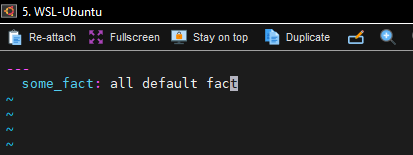
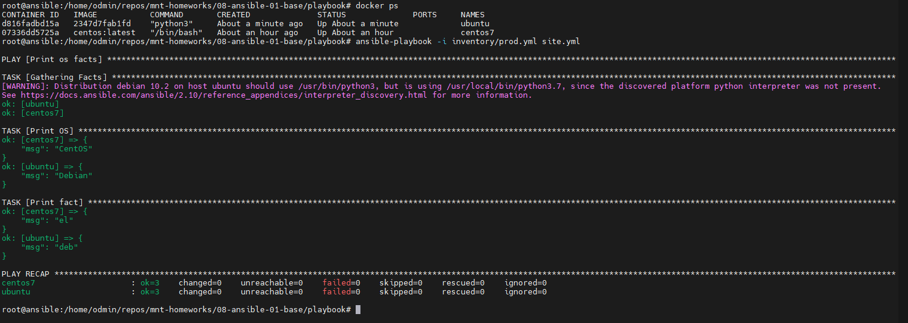
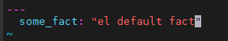
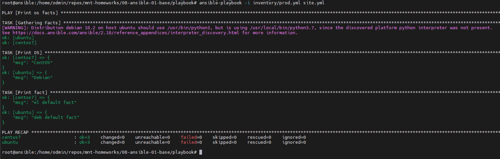
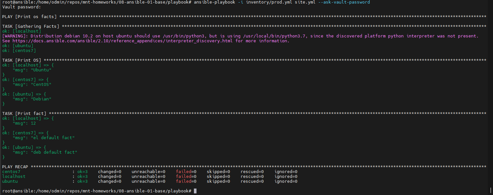
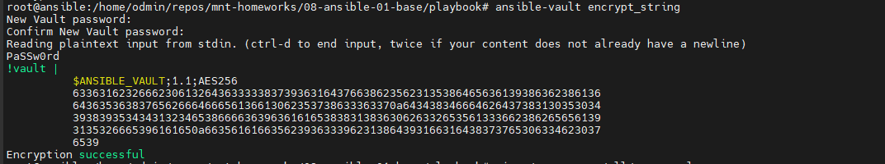
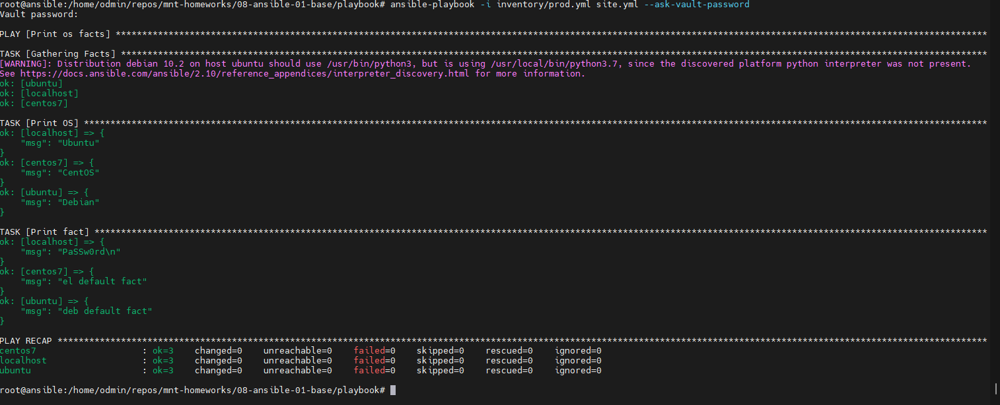
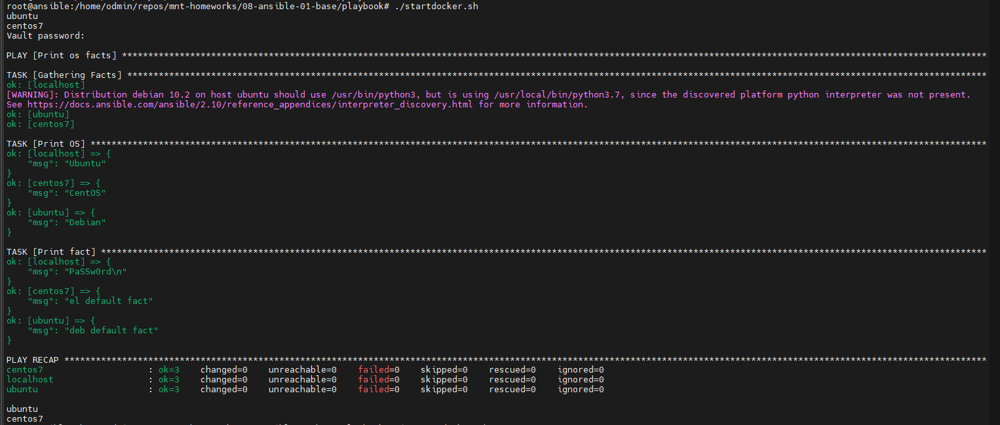

# Домашнее задание к занятию 1 «Введение в Ansible» Повечеровский А.В.

## Подготовка к выполнению

1. Установите Ansible версии 2.10 или выше.
2. Создайте свой публичный репозиторий на GitHub с произвольным именем.
3. Скачайте [Playbook](./playbook/) из репозитория с домашним заданием и перенесите его в свой репозиторий.

## Основная часть

1. Попробуйте запустить playbook на окружении из `test.yml`, зафиксируйте значение, которое имеет факт `some_fact` для указанного хоста при выполнении playbook.
    ```
        ansible-playbook -i ./inventory/test.yml site.yml
        ...

        ...

        TASK [Print fact]       *************************************************************************************************************************************************************   **** *********************************************************
        ok: [localhost] => {
            "msg": 12
        }
    ```
2. Найдите файл с переменными (group_vars), в котором задаётся найденное в первом пункте значение, и поменяйте его на `all default fact`.
    #### Change ./group_vars/all/examp.yml 12 => "all default fact"
    
3. Воспользуйтесь подготовленным (используется `docker`) или создайте собственное окружение для проведения дальнейших испытаний.
    ```
        root@ansible:/home/odmin/repos/mnt-homeworks/08-ansible-01-base/playbook# docker ps
        CONTAINER ID   IMAGE           COMMAND       CREATED              STATUS              PORTS     NAMES
        d816fadbd15a   2347d7fab1fd    "python3"     About a minute ago   Up About a minute             ubuntu
        07336dd5725a   centos:latest   "/bin/bash"   About an hour ago    Up About an hour              centos7
    ```
4. Проведите запуск playbook на окружении из `prod.yml`. Зафиксируйте полученные значения `some_fact` для каждого из `managed host`.
    #### facts for prod.yml
    
5. Добавьте факты в `group_vars` каждой из групп хостов так, чтобы для `some_fact` получились значения: для `deb` — `deb default fact`, для `el` — `el default fact`.
    #### deb fact
    
    #### el fact
    
6.  Повторите запуск playbook на окружении `prod.yml`. Убедитесь, что выдаются корректные значения для всех хостов.
    #### new facts for prod.yml tasks 5-6
    
7. При помощи `ansible-vault` зашифруйте факты в `group_vars/deb` и `group_vars/el` с паролем `netology`.
    ```
        ansible-vault encrypt ./group_vars/el/examp.yml
        ansible-vault encrypt ./group_vars/deb/examp.yml
    ```
8. Запустите playbook на окружении `prod.yml`. При запуске `ansible` должен запросить у вас пароль. Убедитесь в работоспособности.
    ```
        ansible запрашивает пароль только с ключем --ask-vault-password.
    ```
9. Посмотрите при помощи `ansible-doc` список плагинов для подключения. Выберите подходящий для работы на `control node`.
    ```
        Например - local
        Для windows - psrp
    ```
10. В `prod.yml` добавьте новую группу хостов с именем  `local`, в ней разместите localhost с необходимым типом подключения.
    ```
          local:
            hosts:
              localhost:
                ansible_connection: local
    ```
11. Запустите playbook на окружении `prod.yml`. При запуске `ansible` должен запросить у вас пароль. Убедитесь, что факты `some_fact` для каждого из хостов определены из верных `group_vars`.
    #### facts for all hosts
    
12. Заполните `README.md` ответами на вопросы. Сделайте `git push` в ветку `master`. В ответе отправьте ссылку на ваш открытый репозиторий с изменённым `playbook` и заполненным `README.md`.


## Необязательная часть

1. При помощи `ansible-vault` расшифруйте все зашифрованные файлы с переменными.
    ```
        ansible-vault decrypt ./group_vars/deb/examp.yml
        ansible-vault decrypt ./group_vars/el/examp.yml
    ```
2. Зашифруйте отдельное значение `PaSSw0rd` для переменной `some_fact` паролем `netology`. Добавьте полученное значение в `group_vars/all/exmp.yml`.
    #### encrypt `PaSSw0rd` 
    
3. Запустите `playbook`, убедитесь, что для нужных хостов применился новый `fact`.
    #### ansible-playbook -i inventory/prod.yml site.yml --ask-vault-password
    
4. Добавьте новую группу хостов `fedora`, самостоятельно придумайте для неё переменную. В качестве образа можно использовать [этот вариант](https://hub.docker.com/r/pycontribs/fedora).
5. Напишите скрипт на bash: автоматизируйте поднятие необходимых контейнеров, запуск ansible-playbook и остановку контейнеров.
    #### [start stop docker script](./res/startdocker.sh)

    #### Running script.
    
6. Все изменения должны быть зафиксированы и отправлены в ваш личный репозиторий.

---

### Как оформить решение задания

Выполненное домашнее задание пришлите в виде ссылки на .md-файл в вашем репозитории.

---
