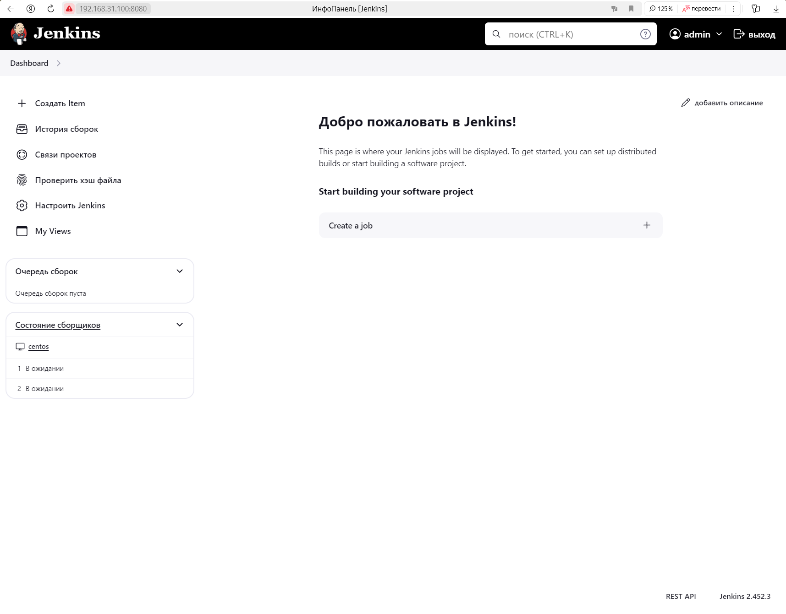
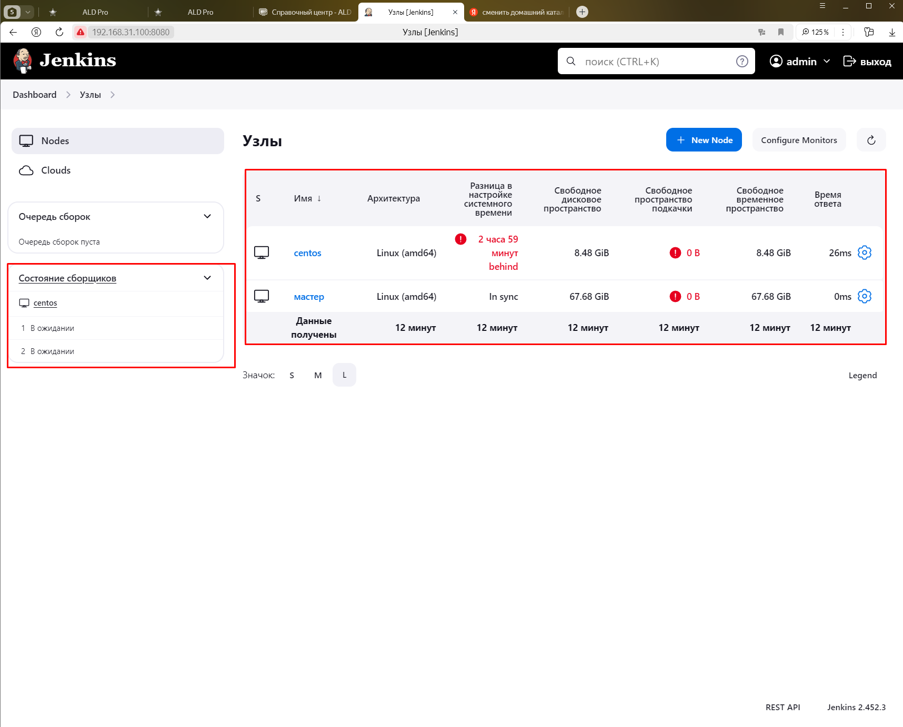
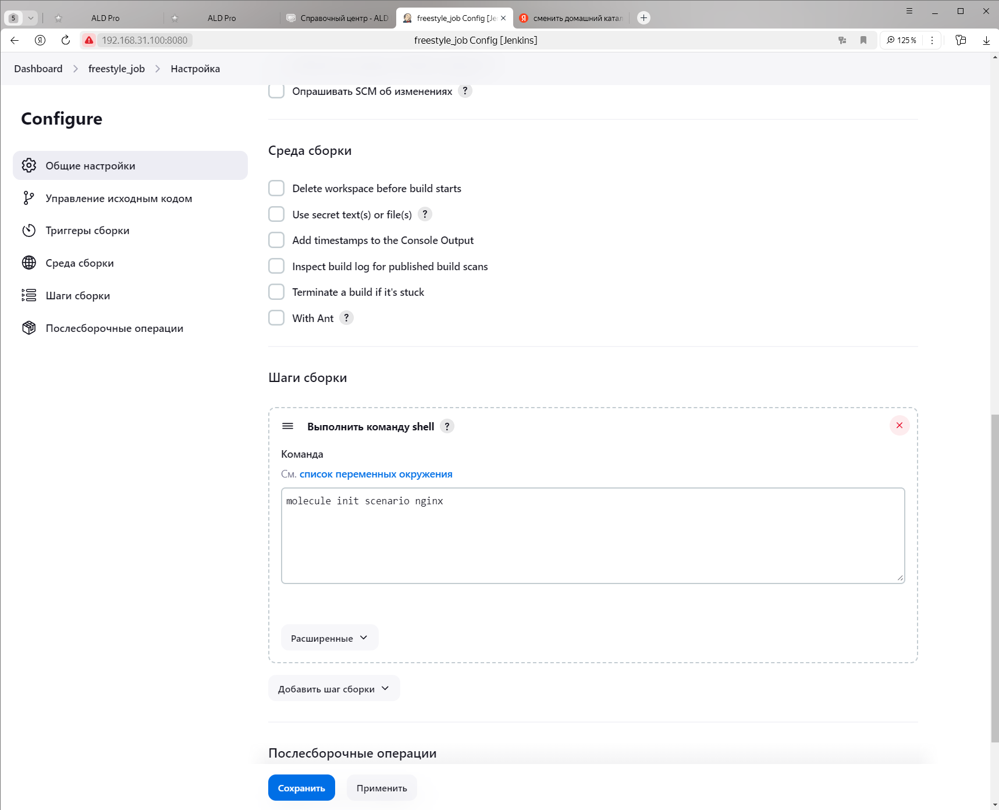
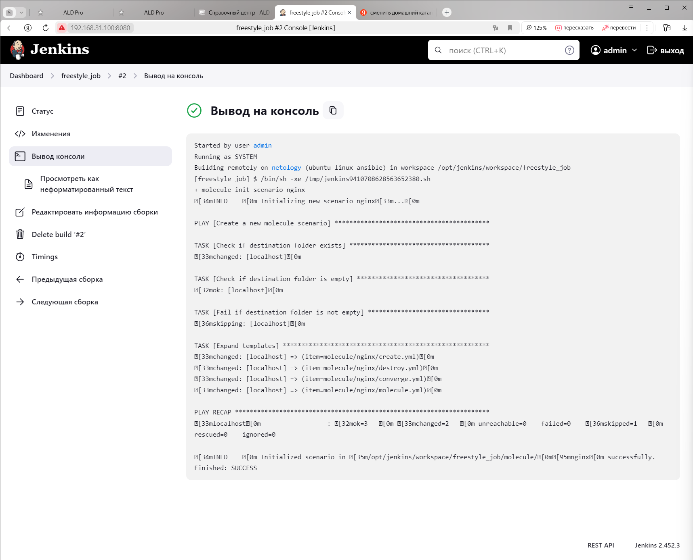
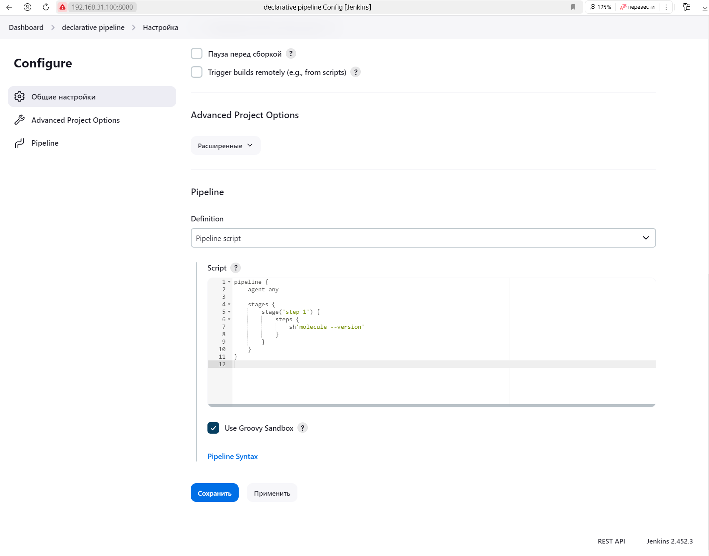
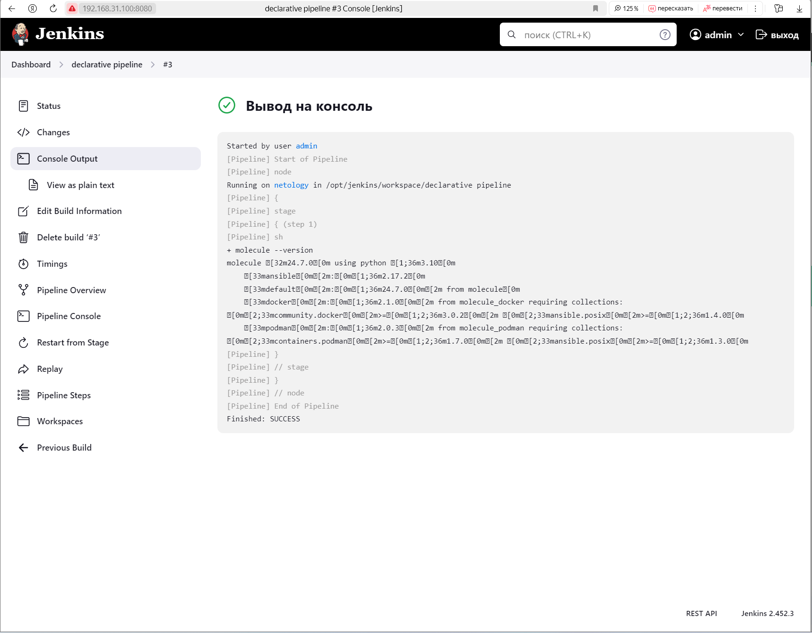
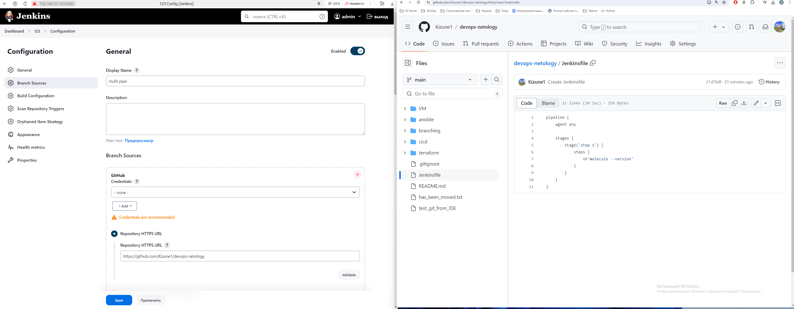
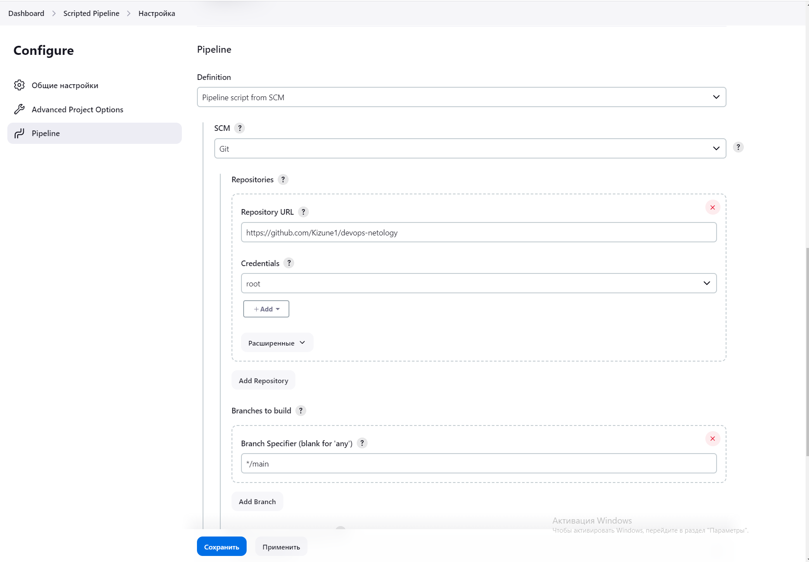
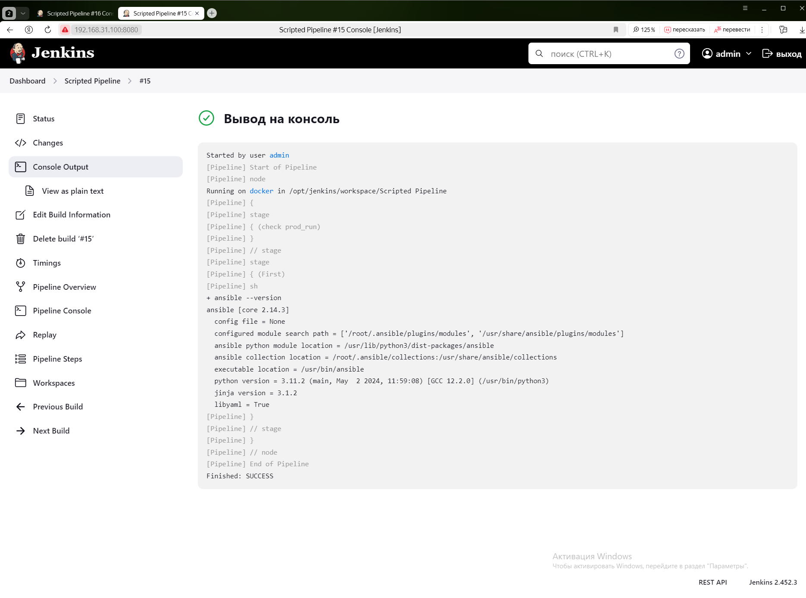
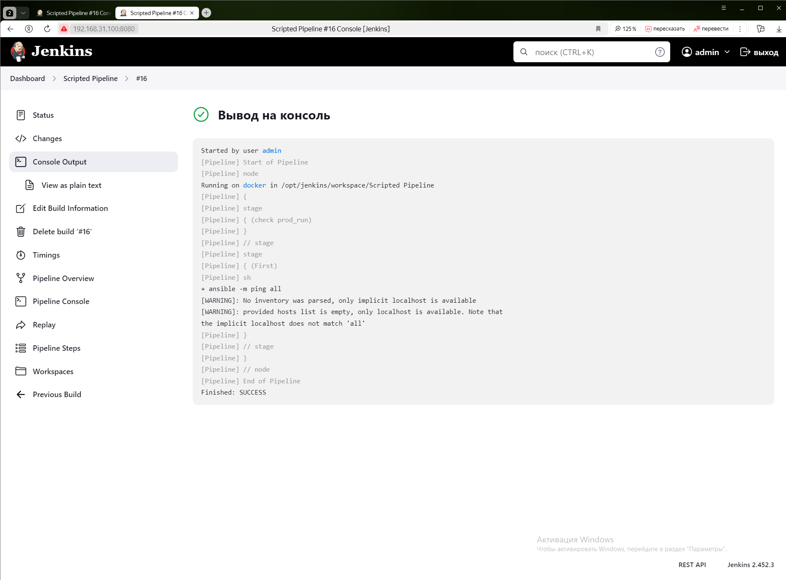

# Домашнее задание к занятию 10 «Jenkins» Повечеровский А.В.

## Подготовка к выполнению

1. Создать два VM: для jenkins-master и jenkins-agent.<br/>
**-- Созданы 2 VM**

2. Установить Jenkins при помощи playbook.<br/>
**-- Установить с помощью playbook не удалось из-за проблем с версионностью. Собрал jenkins в контейнере.**

3. Запустить и проверить работоспособность.<br/>
**-- Jenkins запущен и проверен**


4. Сделать первоначальную настройку.<br/>
**-- Сделана первоначальная настройка. Добавлен агент, сборки на мастере отключены.**


## Основная часть

1. Сделать Freestyle Job, который будет запускать `molecule test` из любого вашего репозитория с ролью.<br/>
**-- Создан Freestyle Job для запуска molecule init scenario**


**-- Выполнение Freestyle Job для запуска molecule init scenario**


2. Сделать Declarative Pipeline Job, который будет запускать `molecule test` из любого вашего репозитория с ролью.<br/>
**-- Создан declarative pipeline для запуска molecule --version**


**-- Выполнен declarative pipeline для запуска molecule --version**


3. Перенести Declarative Pipeline в репозиторий в файл `Jenkinsfile`.<br/>
**-- [Выполнен declarative pipeline для запуска molecule --version](https://github.com/Kizune1/devops-netology/blob/main/cicd/9-cicd/Jenkinsfile)**

4. Создать Multibranch Pipeline на запуск `Jenkinsfile` из репозитория.<br/>
**-- Создан Multibranch pipeline для запуска molecule --version**


5. Создать Scripted Pipeline, наполнить его скриптом из [pipeline](./pipeline).<br/>
**-- Scripted Pipeline создан.**


6. Внести необходимые изменения, чтобы Pipeline запускал `ansible-playbook` без флагов `--check --diff`, если не установлен параметр при запуске джобы (prod_run = True). По умолчанию параметр имеет значение False и запускает прогон с флагами `--check --diff`.<br/>
**-- Мой pipe отличается от созданного выше, но суть этого задания ясна, запускаем определённые блоки кода по условию. Код Pipeline ниже.**
```
node("docker"){
    stage("check prod_run"){
        prod_run=false
    }
    stage("First"){
        if (prod_run){
            sh "ansible --version"
        }
        else{
            sh "ansible -m ping all"
        }
    }
}
```



7. Проверить работоспособность, исправить ошибки, исправленный Pipeline вложить в репозиторий в файл `ScriptedJenkinsfile`.<br/>
**-- Исправленый pipe вложен в репозиторий.**
[ScriptedJenkinsfile](./src/ScriptedJenkinsfile)

8. Отправить ссылку на репозиторий с ролью и Declarative Pipeline и Scripted Pipeline.<br/>
**-- Данные лежат в ./src**

9. Сопроводите процесс настройки скриншотами для каждого пункта задания!!<br/>
**-- Почти на все пункты сделаны скрины. Где-то приложен код.**


## Необязательная часть

1. Создать скрипт на groovy, который будет собирать все Job, завершившиеся хотя бы раз неуспешно. Добавить скрипт в репозиторий с решением и названием `AllJobFailure.groovy`.<br/>
**-- **

2. Создать Scripted Pipeline так, чтобы он мог сначала запустить через Yandex Cloud CLI необходимое количество инстансов, прописать их в инвентори плейбука и после этого запускать плейбук. Мы должны при нажатии кнопки получить готовую к использованию систему.<br/>
**-- **

---

### Как оформить решение задания

Выполненное домашнее задание пришлите в виде ссылки на .md-файл в вашем репозитории.

---