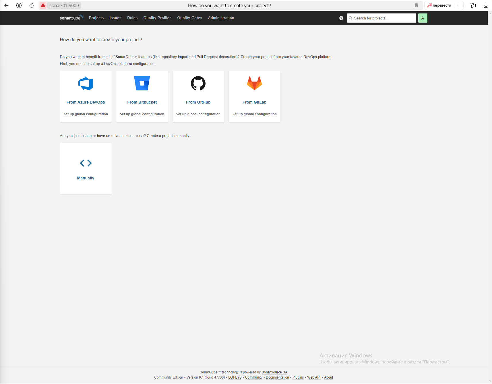
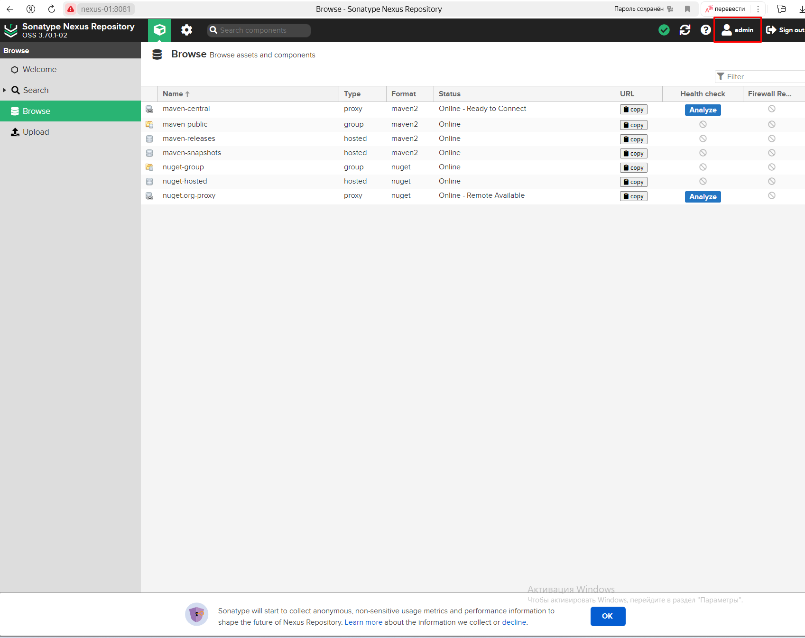

# Домашнее задание к занятию 9 «Процессы CI/CD» **Повечеровский А.В.**
##  т.к. yandex cloud для меня платный теперь, разворачивал на своих мощностях.
## Подготовка к выполнению

1. Создайте два VM в Yandex Cloud с параметрами: 2CPU 4RAM Centos7 (остальное по минимальным требованиям).<br/>
**-- Создано 2 виртуальные машины**
2. Пропишите в [inventory](./infrastructure/inventory/cicd/hosts.yml) [playbook](./infrastructure/site.yml) созданные хосты.<br/>
**-- Машины прописаны в inventory.**
3. Добавьте в [files](./infrastructure/files/) файл со своим публичным ключом (id_rsa.pub). Если ключ называется иначе — найдите таску в плейбуке, которая использует id_rsa.pub имя, и исправьте на своё.<br/>
**-- Ключ добавлен**
4. Запустите playbook, ожидайте успешного завершения.<br/>
**-- Код запущен, хотелось бы видеть зависимости для версии ansible-core, т.к. на моей версии сразу не взлетело всё, поднимал другую версию через докер. Есть некоторые несостыковки в коде, пришлось редактировать его, чтобы сонар установился, например некорректные зеркала для CentOS, а так де отсутствие пакетов postgressql-11, поменял на 12 версию со всеми остальными тасками, которые затрагивают версию postgres. Nexsus залился без сильных проблем, но падает при запуске. Накинул его контейнером sonatype/nexus3**
5. Проверьте готовность SonarQube через [браузер](http://localhost:9000).<br/>
**-- Sonar доступен по порту 9000**
6. Зайдите под admin\admin, поменяйте пароль на свой.<br/>
**-- Пароль изменен**

7.  Проверьте готовность Nexus через [бразуер](http://localhost:8081).<br/>
**-- Nexus доступен по порту 8081**
8. Подключитесь под admin\admin123, поменяйте пароль, сохраните анонимный доступ.<br/>
**-- Пароль изменен, admin123 не подошел, но была ссылка на созданый пароль на сервере**


## Знакомоство с SonarQube

### Основная часть

1. Создайте новый проект, название произвольное.<br/>
**-- Создан проект my-project**
2. Скачайте пакет sonar-scanner, который вам предлагает скачать SonarQube.<br/>
**-- Sonar-Scaner установлен**
```
sudo wget https://binaries.sonarsource.com/Distribution/sonar-scanner-cli/sonar-scanner-cli-4.2.0.1873-linux.zip
sudo unzip sonar-scanner-cli-4.2.0.1873-linux.zip
sudo mv sonar-scanner-cli-4.2.0.1873-linux /opt/sonar-scanner-cli-4.2.0.1873-linux/
```
3. Сделайте так, чтобы binary был доступен через вызов в shell (или поменяйте переменную PATH, или любой другой, удобный вам способ).<br/>
**-- Добвалены переменные окружения**
```
export SONAR_SCANNER_HOME=/opt/sonar-scanner-4.2.0.1873-linux/sonar-scanner-cli-4.2.0.1873-linux/
export PATH=$SONAR_SCANNER_HOME/bin:$PATH
```
4. Проверьте `sonar-scanner --version`.<br/>
**-- sonar-scanner --version**
```
INFO: Scanner configuration file: /opt/sonar-scanner-4.2.0.1873-linux/sonar-scanner-4.2.0.1873-linux/conf/sonar-scanner.properties
INFO: Project root configuration file: NONE
INFO: SonarQube Scanner 4.2.0.1873
INFO: Java 11.0.3 AdoptOpenJDK (64-bit)
INFO: Linux 3.10.0-1160.119.1.el7.x86_64 amd64
```
5. Запустите анализатор против кода из директории [example](./example) с дополнительным ключом `-Dsonar.coverage.exclusions=fail.py`.<br/>
**-- Анализатор запущен, код успешно проанализирован**
```
INFO: ANALYSIS SUCCESSFUL, you can browse http://localhost:9000/dashboard?id=my-project
INFO: Note that you will be able to access the updated dashboard once the server has processed the submitted analysis report
INFO: More about the report processing at http://localhost:9000/api/ce/task?id=AZDVleMRGHQTOAve0yAr
INFO: Analysis total time: 3.630 s
INFO: ------------------------------------------------------------------------
INFO: EXECUTION SUCCESS
INFO: ------------------------------------------------------------------------
INFO: Total time: 5.326s
INFO: Final Memory: 7M/24M
INFO: ------------------------------------------------------------------------
```
6. Посмотрите результат в интерфейсе.<br/>
**-- Данные в интерфейсе**

7. Исправьте ошибки, которые он выявил, включая warnings.<br/>
**-- Ошибки исправлены**

8. Запустите анализатор повторно — проверьте, что QG пройдены успешно.<br/>
**-- Анализ запущен повторно.**

9. Сделайте скриншот успешного прохождения анализа, приложите к решению ДЗ.<br/>
**-- Баги пропали из интерфейса**


## Знакомство с Nexus

### Основная часть

1. В репозиторий `maven-public` загрузите артефакт с GAV-параметрами:

 *    groupId: netology;
 *    artifactId: java;
 *    version: 8_282;
 *    classifier: distrib;
 *    type: tar.gz.

**-- Артефакт загружен**

2. В него же загрузите такой же артефакт, но с version: 8_102.<br/>
**-- Загружен такой же артефакт версией ниже**

3. Проверьте, что все файлы загрузились успешно.<br/>
**-- Файлы загрузились корректно**

4. В ответе пришлите файл `maven-metadata.xml` для этого артефекта.<br/>
**-- Метадата во вложении**
[maven-metadata.xml](./src/maven-metadata.xml)

### Знакомство с Maven

### Подготовка к выполнению

1. Скачайте дистрибутив с [maven](https://maven.apache.org/download.cgi).<br/>
**-- sudo yum install maven**

2. Разархивируйте, сделайте так, чтобы binary был доступен через вызов в shell (или поменяйте переменную PATH, или любой другой, 
удобный вам способ).<br/>
**-- Пакет скачан и распакован с помощью yum**

3. Удалите из `apache-maven-<version>/conf/settings.xml` упоминание о правиле, отвергающем HTTP- соединение — раздел mirrors —> id: my-repository-http-unblocker.<br/>
**-- Не понадобилось, такого правила нет в settings.xml**

4. Проверьте `mvn --version`.<br/>
**-- Версия maven**
```
Apache Maven 3.0.5 (Red Hat 3.0.5-17)
Maven home: /usr/share/maven
Java version: 11, vendor: Oracle Corporation
Java home: /opt/jdk/openjdk-11+28_linux
Default locale: en_US, platform encoding: UTF-8
OS name: "linux", version: "3.10.0-1160.119.1.el7.x86_64", arch: "amd64", family: "unix"
```

5. Заберите директорию [mvn](./mvn) с pom.<br/>
**-- Директория добавлена на сервер с maven.**

### Основная часть

1. Поменяйте в `pom.xml` блок с зависимостями под ваш артефакт из первого пункта задания для Nexus (java с версией 8_282).<br/>
**-- pom.xml изменён согласно артефакту из предыдущего задания.**
```
      <groupId>netology</groupId>
      <artifactId>java</artifactId>
      <version>8_282</version>
      <classifier>distrib</classifier>
      <type>tar.gz</type>
```

2. Запустите команду `mvn package` в директории с `pom.xml`, ожидайте успешного окончания.<br/>
**-- Успешное окончание работы maven**
```
[INFO] Building jar: /home/odmin/mvn/target/simple-app-1.0-SNAPSHOT.jar
[INFO] ------------------------------------------------------------------------
[INFO] BUILD SUCCESS
[INFO] ------------------------------------------------------------------------
[INFO] Total time: 10.820s
[INFO] Finished at: Sun Jul 21 07:55:32 PDT 2024
[INFO] Final Memory: 9M/37M
[INFO] ------------------------------------------------------------------------

```

3. Проверьте директорию `~/.m2/repository/`, найдите ваш артефакт.<br/>
**-- Директория отличается /home/odmin/mvn/target/simple-app-1.0-SNAPSHOT.jar**

4. В ответе пришлите исправленный файл `pom.xml`.<br/>
**-- poml.xml во вложении**
[pom.xml](./src/pom.xml)
---

### Как оформить решение задания

Выполненное домашнее задание пришлите в виде ссылки на .md-файл в вашем репозитории.

---