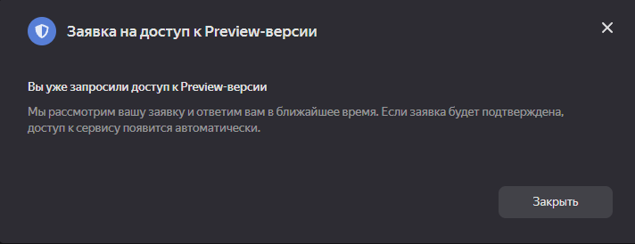
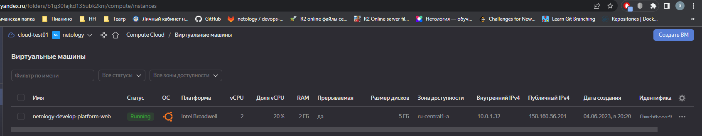
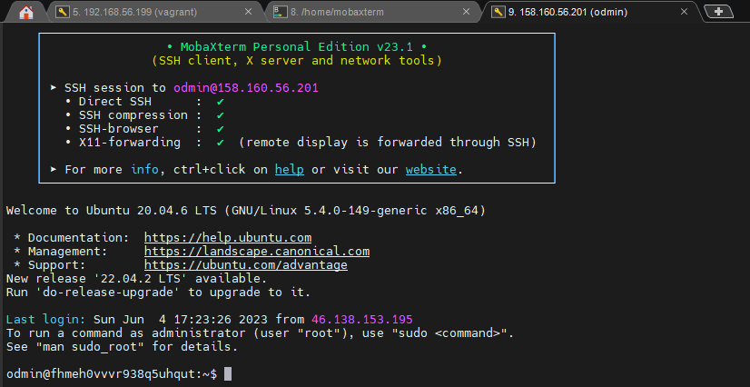

# Домашнее задание к занятию 2. «Основы Terraform. Yandex Cloud» Повечеровский А.В

### Цель задания

1. Создать свои ресурсы в облаке Yandex Cloud с помощью Terraform.
2. Освоить работу с переменными Terraform.


### Чеклист готовности к домашнему заданию

1. Зарегистрирован аккаунт в Yandex Cloud. Использован промокод на грант.
2. Установлен инструмент Yandex Cli.
3. Исходный код для выполнения задания расположен в директории [**02/src**](https://github.com/netology-code/ter-homeworks/tree/main/02/src).


### Задание 0

1. Ознакомьтесь с [документацией к security-groups в Yandex Cloud](https://cloud.yandex.ru/docs/vpc/concepts/security-groups?from=int-console-help-center-or-nav).
```
    С документацией ознакомился.
```
2. Запросите preview доступ к данному функционалу в ЛК Yandex Cloud. Обычно его выдают в течении 24-х часов.
https://console.cloud.yandex.ru/folders/<ваш cloud_id>/vpc/security-groups.   
Этот функционал понадобится к следующей лекции. 


### Задание 1

1. Изучите проект. В файле variables.tf объявлены переменные для yandex provider.
2. Переименуйте файл personal.auto.tfvars_example в personal.auto.tfvars. Заполните переменные (идентификаторы облака, токен доступа). Благодаря .gitignore этот файл не попадет в публичный репозиторий. **Вы можете выбрать иной способ безопасно передать секретные данные в terraform.**
```
    Для авторизации я пользуюсь сервисным аккаунтом. [Скриптом](./res/yc_service_key.sh) получаю ключ и записываю его в key.json
    В [providers.tf](./res/providers.tf) указываю key.json в качестве key-файла.
    Cloud и folder id беру из personal.auto.tfvars.
```
3. Сгенерируйте или используйте свой текущий ssh ключ. Запишите его открытую часть в переменную **vms_ssh_root_key**.
```
    Metadata берется из файла [meta.yml](./res/meta.yml), туда входят логин, группа sudo, оболочка, безпарольный sudo и ssh public key.
```
4. Инициализируйте проект, выполните код. Исправьте возникшую ошибку. Ответьте в чем заключается ее суть?
```
    Необходимо чётное кол-во ядер минимум 2.
```
5. Ответьте, как в процессе обучения могут пригодиться параметры```preemptible = true``` и ```core_fraction=5``` в параметрах ВМ? Ответ в документации Yandex cloud.
```
    core_fraction = 5 --- Означает % допустимой загрузки ЦП. В обучении не так важна скороть, а вот грант будет расходоваться меньше.
    preemptible = true --- Включает опцию прерываемой vm. После 24 часов она выключится и не будет забирать ресурсы.
```

В качестве решения приложите:
#### - скриншот ЛК Yandex Cloud с созданной ВМ

#### - скриншот успешного подключения к консоли ВМ через ssh

- ответы на вопросы. Выше.

#### [Ссылка на main.tf](./res/main.tf)


### Задание 2

1. Изучите файлы проекта.
2. Замените все "хардкод" **значения** для ресурсов **yandex_compute_image** и **yandex_compute_instance** на **отдельные** переменные. К названиям переменных ВМ добавьте в начало префикс **vm_web_** .  Пример: **vm_web_name**.
2. Объявите нужные переменные в файле variables.tf, обязательно указывайте тип переменной. Заполните их **default** прежними значениями из main.tf. 
3. Проверьте terraform plan (изменений быть не должно).
```
    vagrant@server1:~/Netology-DevOps/4-terraform/terr-less-2/src$ terraform plan
    data.yandex_compute_image.ubuntu: Reading...
    yandex_vpc_network.develop: Refreshing state... [id=enpuoerqjvkr3nsvua0v]
    data.yandex_compute_image.ubuntu: Read complete after 0s [id=fd8lape4adm5melne14m]
    yandex_vpc_subnet.develop: Refreshing state... [id=e9bofkp8j79grfnua3cg]
    yandex_compute_instance.platform: Refreshing state... [id=fhmhvcbap8gi2eiph9hs]

    No changes. Your infrastructure matches the configuration.

    Terraform has compared your real infrastructure against your configuration and found no differences, so no changes are needed.
```

#### [Ссылка на main.tf без хардкода :)](./res/main_without_hardcode.tf)

### Задание 3

1. Создайте в корне проекта файл 'vms_platform.tf' . Перенесите в него все переменные первой ВМ.
2. Скопируйте блок ресурса и создайте с его помощью вторую ВМ(в файле main.tf): **"netology-develop-platform-db"** ,  cores  = 2, memory = 2, core_fraction = 20. Объявите ее переменные с префиксом **vm_db_** в том же файле('vms_platform.tf').
3. Примените изменения.

#### [vms_platform.tf](./res/vms_platform.tf)


### Задание 4

1. Объявите в файле outputs.tf output типа map, содержащий { instance_name = external_ip } для каждой из ВМ.
2. Примените изменения.

В качестве решения приложите вывод значений ip-адресов команды ```terraform output```
```
    vagrant@server1:~/Netology-DevOps/4-terraform/terr-less-2/src$ terraform output
    external_ip_address_platform_yandex_cloud1_vm_db = "51.250.92.91"
    external_ip_address_platform_yandex_cloud_vm_web = "62.84.117.164"
    internal_ip_address_platform_yandex_cloud_vm_db = "10.0.1.22"
    internal_ip_address_platform_yandex_cloud_vm_web = "10.0.1.15"
```

### Задание 5

1. В файле locals.tf опишите в **одном** local-блоке имя каждой ВМ, используйте интерполяцию ${..} с несколькими переменными по примеру из лекции.
#### [locals.tf](./res/locals.tf)
2. Замените переменные с именами ВМ из файла variables.tf на созданные вами local переменные.
3. Примените изменения.
```
     + name                      = "netology-develop-platform-web"
     + name                      = "netology-develop-platform-db"
```
#### [main with locals variables](./res/main_with_locals.tf)

### Задание 6

1. Вместо использования 3-х переменных  ".._cores",".._memory",".._core_fraction" в блоке  resources {...}, объедените их в переменные типа **map** с именами "vm_web_resources" и "vm_db_resources".

Добавлены блоки:
```
    variable "vm_web_resources" {
      type = map(number)
      default = {
        cores = 4
        memory = 4
        core_fraction = 20
      }
    }
    variable "vm_db_resources" {
        type = map(number)
        default = {
          cores = 2
          memory = 2
          core_fraction = 20
        }   
    }
```
2. Так же поступите с блоком **metadata {serial-port-enable, ssh-keys}**, эта переменная должна быть общая для всех ваших ВМ.

Данный блок обращается к отдельному файлу:
```
    metadata = {
    serial-port-enable = 1
    user-data = "${file("./meta.yml")}"
  }
```
3. Найдите и удалите все более не используемые переменные проекта.

[Variables without unnecessary](./res/variables_without_uness.tf)

4. Проверьте terraform plan (изменений быть не должно).

```
    No changes. Your infrastructure matches the configuration
```

------

## Дополнительные задания (со звездочкой*)

**Настоятельно рекомендуем выполнять все задания под звёздочкой.**   
Их выполнение поможет глубже разобраться в материале. Задания под звёздочкой дополнительные (необязательные к выполнению) и никак не повлияют на получение вами зачета по этому домашнему заданию. 

### Задание 7*

Изучите содержимое файла console.tf. Откройте terraform console, выполните следующие задания: 

```
    locals {

      test_list = ["develop", "staging", "production"]

      test_map = {
        admin = "John"
        user  = "Alex"
      }

      servers = {
        develop = {
          cpu   = 2
          ram   = 4
          image = "ubuntu-21-10"
          disks = ["vda", "vdb"]
        },
        stage = {
          cpu   = 4
          ram   = 8
          image = "ubuntu-20-04"
          disks = ["vda", "vdb"]
        },
        production = {
          cpu   = 10
          ram   = 40
          image = "ubuntu-20-04"
          disks = ["vda", "vdb", "vdc", "vdd"]
        }
      }
    }
```

1. Напишите, какой командой можно отобразить **второй** элемент списка test_list?
```
    > local.test_list.1
    "staging"
```
2. Найдите длину списка test_list с помощью функции length(<имя переменной>).
```
    > length(local.test_list)
    3
```
3. Напишите, какой командой можно отобразить значение ключа admin из map test_map ?
```
    > local.test_map.admin
    "John"
```
4. Напишите interpolation выражение, результатом которого будет: "John is admin for production server based on OS ubuntu-20-04 with X vcpu, Y ram and Z virtual disks", используйте данные из переменных test_list, test_map, servers и функцию length() для подстановки значений.
```
    msg = "${ local.test_map.admin } is ${ local.test_list.3 } for server ${ local.test_list.2 } based on OS ${ local.servers.production.image } with ${ local.servers.production.cpu } vcpu, ${ local.servers.production.ram } ram and ${ length(local.servers.production.disks) } virtual disks" 

    > local.msg
    "John is admin for server production based on OS ubuntu-20-04 with 10 vcpu, 40 ram and 4 virtual disks"
```
В качестве решения предоставьте необходимые команды и их вывод.
