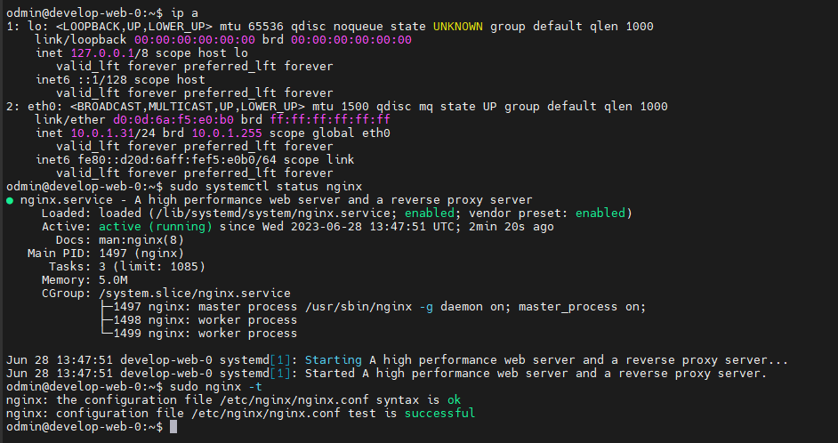

# Домашнее задание к занятию "Продвинутые методы работы с Terraform" Повечеровский А.В.


### Задание 1

1. Возьмите из [демонстрации к лекции готовый код](https://github.com/netology-code/ter-homeworks/tree/main/04/demonstration1) для создания ВМ с помощью remote модуля.
2. Создайте 1 ВМ, используя данный модуль. В файле cloud-init.yml необходимо использовать переменную для ssh ключа вместо хардкода. Передайте ssh-ключ в функцию template_file в блоке vars ={} .
Воспользуйтесь [**примером**](https://grantorchard.com/dynamic-cloudinit-content-with-terraform-file-templates/). Обратите внимание что ssh-authorized-keys принимает в себя список, а не строку!
3. Добавьте в файл cloud-init.yml установку nginx.
4. Предоставьте скриншот подключения к консоли и вывод команды ```sudo nginx -t```.

### Решение 1

#### Скриншот созданой машины с nginx.



### Задание 2

1. Напишите локальный модуль vpc, который будет создавать 2 ресурса: **одну** сеть и **одну** подсеть в зоне, объявленной при вызове модуля. например: ```ru-central1-a```.

  - [Модуль yc_network.](./yc_network/)

2. Модуль должен возвращать значения vpc.id и subnet.id

  - [Outputs модуля yc_network](./yc_network/outputs.tf)

3. Замените ресурсы yandex_vpc_network и yandex_vpc_subnet, созданным модулем.

  ```
    module "yc_network" {
      source = "../yc_network"
    }

    module "test-vm" {
      source          = "git::https://github.com/udjin10/yandex_compute_instance.git?ref=main"
      network_id      = module.yc_network.network_id
      subnet_zones    = ["ru-central1-a"]
      subnet_ids      = [ module.yc_network.subnet_id ]
      instance_name   = "web"
      instance_count  = 2
      image_family    = "ubuntu-2004-lts"
      public_ip       = true

      metadata = {
          user-data          = data.template_file.cloudinit.rendered #Для демонстрации №3
          serial-port-enable = 1
      }

    }
  ```

4. Сгенерируйте документацию к модулю с помощью terraform-docs.

  - [README.md модуля yc_network](./yc_network/README.md)    
 


### Задание 3
1. Выведите список ресурсов в стейте.
  ```
    data.template_file.cloudinit
    module.test-vm.data.yandex_compute_image.my_image
    module.test-vm.yandex_compute_instance.vm[0]
    module.test-vm.yandex_compute_instance.vm[1]
    module.yc_network.yandex_vpc_network.develop
    module.yc_network.yandex_vpc_subnet.develop
  ```
2. Удалите из стейта модуль vpc.

  ```
    Removed module.yc_network.yandex_vpc_network.develop
    Removed module.yc_network.yandex_vpc_subnet.develop
    Successfully removed 2 resource instance(s).
  ```

3. Импортируйте его обратно. Проверьте terraform plan - изменений быть не должно.
Приложите список выполненных команд и вывод.
  ```
  terraform import 'module.yc_network.yandex_vpc_network.develop' 'enpu86o6rctqf2dr837l'

        data.template_file.cloudinit: Reading...
        data.template_file.cloudinit: Read complete after 0s [id=8da66e2692944902eff768d095bb335e14a9db290df1a1fc68ab8f022cb4cf35]
        module.yc_network.yandex_vpc_network.develop: Importing from ID "enpu86o6rctqf2dr837l"...
        module.yc_network.yandex_vpc_network.develop: Import prepared!
          Prepared yandex_vpc_network for import
        module.yc_network.yandex_vpc_network.develop: Refreshing state... [id=enpu86o6rctqf2dr837l]
        module.test-vm.data.yandex_compute_image.my_image: Reading...
        module.test-vm.data.yandex_compute_image.my_image: Read complete after 0s [id=fd852pbtueis1q0pbt4o]

        Import successful!

        The resources that were imported are shown above. These resources are now in
        your Terraform state and will henceforth be managed by Terraform.

  ```

  ```
  terraform import 'module.yc_network.yandex_vpc_subnet.develop' 'e9balt6aj330tu9nugpp'

        data.template_file.cloudinit: Reading...
        data.template_file.cloudinit: Read complete after 0s [id=8da66e2692944902eff768d095bb335e14a9db290df1a1fc68ab8f022cb4cf35]
        module.test-vm.data.yandex_compute_image.my_image: Reading...
        module.yc_network.yandex_vpc_subnet.develop: Importing from ID "e9balt6aj330tu9nugpp"...
        module.yc_network.yandex_vpc_subnet.develop: Import prepared!
          Prepared yandex_vpc_subnet for import
        module.yc_network.yandex_vpc_subnet.develop: Refreshing state... [id=e9balt6aj330tu9nugpp]
        module.test-vm.data.yandex_compute_image.my_image: Read complete after 1s [id=fd852pbtueis1q0pbt4o]
        
        Import successful!
        
        The resources that were imported are shown above. These resources are now in
        your Terraform state and will henceforth be managed by Terraform.
  ```

## Дополнительные задания (со звездочкой*)

**Настоятельно рекомендуем выполнять все задания под звёздочкой.**   Их выполнение поможет глубже разобраться в материале.   
Задания под звёздочкой дополнительные (необязательные к выполнению) и никак не повлияют на получение вами зачета по этому домашнему заданию. 


### Задание 4*

1. Измените модуль vpc так, чтобы он мог создать подсети во всех зонах доступности, переданных в переменной типа list(object) при вызове модуля.  
  
Пример вызова:
```
module "vpc_prod" {
  source       = "./vpc"
  env_name     = "production"
  subnets = [
    { zone = "ru-central1-a", cidr = "10.0.1.0/24" },
    { zone = "ru-central1-b", cidr = "10.0.2.0/24" },
    { zone = "ru-central1-c", cidr = "10.0.3.0/24" },
  ]
}

module "vpc_dev" {
  source       = "./vpc"
  env_name     = "develop"
  subnets = [
    { zone = "ru-central1-a", cidr = "10.0.1.0/24" },
  ]
}
```

Предоставьте код, план выполнения, результат из консоли YC.

### Задание 5***

1. Напишите модуль для создания кластера managed БД Mysql в Yandex Cloud с 1 или 3 хостами в зависимости от переменной HA=true или HA=false. Используйте ресурс yandex_mdb_mysql_cluster (передайте имя кластера и id сети).
2. Напишите модуль для создания базы данных и пользователя в уже существующем кластере managed БД Mysql. Используйте ресурсы yandex_mdb_mysql_database и yandex_mdb_mysql_user (передайте имя базы данных, имя пользователя и id кластера при вызове модуля).
3. Используя оба модуля, создайте кластер example из одного хоста, а затем добавьте в него БД test и пользователя app. Затем измените переменную и превратите сингл хост в кластер из 2х серверов.
4. 
Предоставьте план выполнения и по-возможности результат. Сразу же удаляйте созданные ресурсы, так как кластер может стоить очень дорого! Используйте минимальную конфигурацию.

### Задание 6*

1. Разверните у себя локально vault, используя docker-compose.yml в проекте.
2. Для входа в web интерфейс и авторизации terraform в vault используйте токен "education"
3. Создайте новый секрет по пути http://127.0.0.1:8200/ui/vault/secrets/secret/create  
Path: example  
secret data key: test 
secret data value: congrats!  
4. Считайте данный секрет с помощью terraform и выведите его в output по примеру:
```
provider "vault" {
 address = "http://<IP_ADDRESS>:<PORT_NUMBER>"
 skip_tls_verify = true
 token = "education"
}
data "vault_generic_secret" "vault_example"{
 path = "secret/example"
}

output "vault_example" {
 value = "${nonsensitive(data.vault_generic_secret.vault_example.data)}"
} 

можно обратится не к словарю, а конкретному ключу.
terraform console: >nonsensitive(data.vault_generic_secret.vault_example.data.<имя ключа в секрете>)
```
5. Попробуйте самостоятельно разобраться в документации и записать новый секрет в vault с помощью terraform. 


### Правила приема работы

В своём git-репозитории создайте новую ветку terraform-04, закомитьте в эту ветку свой финальный код проекта. Ответы на задания и необходимые скриншоты оформите в md-файле в ветке terraform-04.

В качестве результата прикрепите ссылку на ветку terraform-04 в вашем репозитории.
