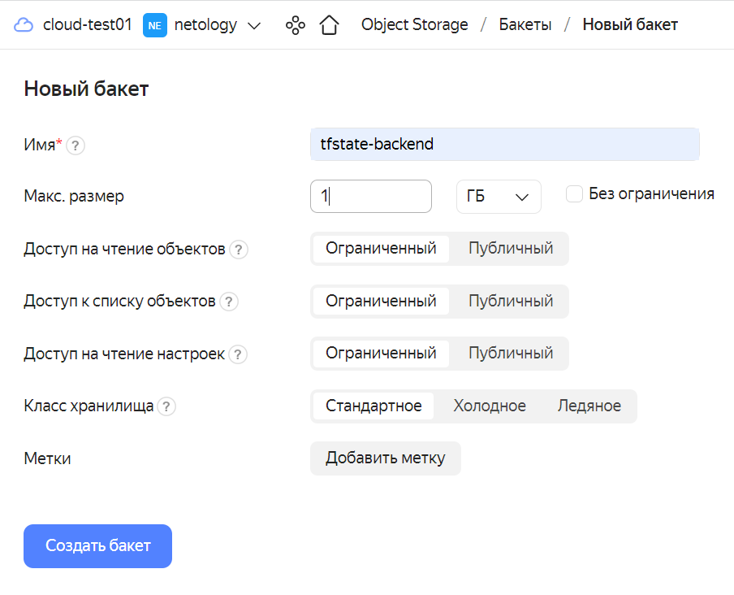
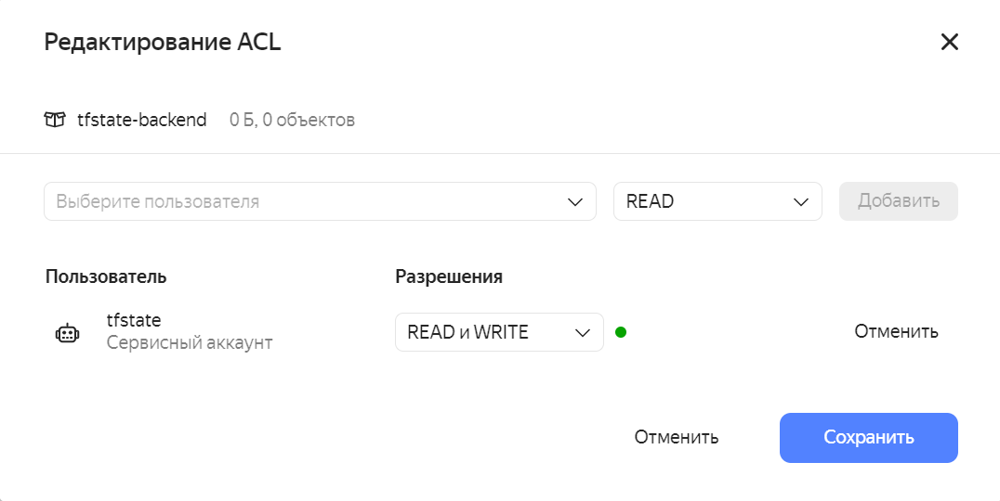
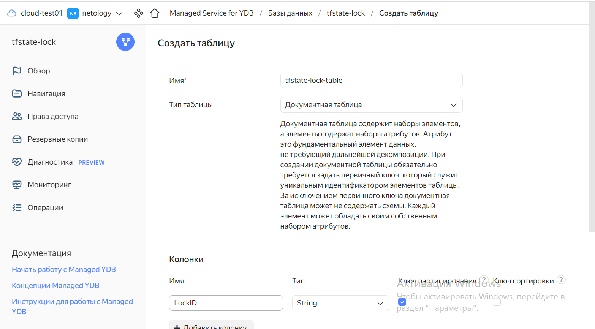

# Домашнее задание к занятию "Использование Terraform в команде" Повечеровский А.В.

### Цель задания

1. Научиться использовать remote state.
2. Освоить приемы командной работы.

### Задание 1

1. Возьмите код:
- из [ДЗ к лекции №04](https://github.com/netology-code/ter-homeworks/tree/main/04/src) 
- из [демо к лекции №04](https://github.com/netology-code/ter-homeworks/tree/main/04/demonstration1).
2. Проверьте код с помощью tflint и checkov. Вам не нужно инициализировать этот проект.
3. Перечислите какие **типы** ошибок обнаружены в проекте (без дублей).
```
    В demo1 ошибки:
        CKV_YC_2 -- На хост не назначен публичный IP.
        CKV_YC_4 -- Не активен Serial Console Port.
        CKV_YC_11 -- На сетевой порт не назначена группа безопасности.
```
------

### Задание 2

1. Возьмите ваш GitHub репозиторий с **выполненным ДЗ №4** в ветке 'terraform-04' и сделайте из него ветку 'terraform-05'
2. Повторите демонстрацию лекции: настройте YDB, S3 bucket, yandex service account, права доступа и мигрируйте State проекта в S3 с блокировками. Предоставьте скриншоты процесса в качестве ответа.
#### Создание бакета.


#### Добавление прав сервисному аккаунту


#### Создание базы ydb


#### Создание таблицы ydb



3. Закомитьте в ветку 'terraform-05' все изменения.
4. Откройте в проекте terraform console, а в другом окне из этой же директории попробуйте запустить terraform apply.
5. Пришлите ответ об ошибке доступа к State.
6. Принудительно разблокируйте State. Пришлите команду и вывод.


------
### Задание 3  

1. Сделайте в GitHub из ветки 'terraform-05' новую ветку 'terraform-hotfix'.
2. Проверье код с помощью tflint и checkov, исправьте все предупреждения и ошибки в 'terraform-hotfix', сделайте комит.
3. Откройте новый pull request 'terraform-hotfix' --> 'terraform-05'. 
4. Вставьте в комментарий PR результат анализа tflint и checkov, план изменений инфраструктуры из вывода команды terraform plan.
5. Пришлите ссылку на PR для ревью(вливать код в 'terraform-05' не нужно).

------
### Задание 4

1. Напишите переменные с валидацией и протестируйте их, заполнив default верными и неверными значениями. Предоставьте скриншоты проверок из terraform console. 

- type=string, description="ip-адрес", проверка что значение переменной содержит верный IP-адрес с помощью функций cidrhost() или regex(). Тесты:  "192.168.0.1" и "1920.1680.0.1"
- type=list(string), description="список ip-адресов", проверка что все адреса верны.  Тесты:  ["192.168.0.1", "1.1.1.1", "127.0.0.1"] и ["192.168.0.1", "1.1.1.1", "1270.0.0.1"]

## Дополнительные задания (со звездочкой*)

**Настоятельно рекомендуем выполнять все задания под звёздочкой.**   Их выполнение поможет глубже разобраться в материале.   
Задания под звёздочкой дополнительные (необязательные к выполнению) и никак не повлияют на получение вами зачета по этому домашнему заданию. 
------
### Задание 5*
1. Напишите переменные с валидацией:
- type=string, description="любая строка", проверка что строка не содержит в себе символов верхнего регистра
- type=object, проверка что одно из значений равно true, а второе false, те не допускается false false и true true:
```
variable "in_the_end_there_can_be_only_one" {
    description="Who is better Connor or Duncan?"
    type = object({
        Dunkan = optional(bool)
        Connor = optional(bool)
    })

    default = {
        Dunkan = true
        Connor = false
    }

    validation {
        error_message = "There can be only one MacLeod"
        condition = <проверка>
    }
}
```
------
### Задание 6**  

1. Настройте любую известную вам CI/CD систему. Если вы еще не знакомы с CI/CD  системами - настоятельно рекомендуем вернуться к данному заданию после изучения Jenkins/Teamcity/Gitlab.
2. Скачайте с ее помощью ваш репозиторий с кодом и инициализируйте инфраструктуру.
3. Уничтожтье инфраструктуру тем же способом.


### Правила приема работы

Ответы на задания и необходимые скриншоты оформите в md-файле в ветке terraform-05.

В качестве результата прикрепите ссылку на ветку terraform-05 в вашем репозитории.